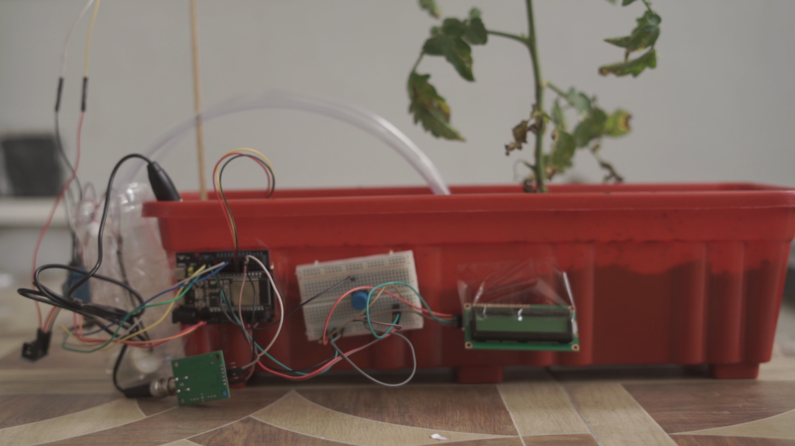

# Smart Plant IoT System



## Overview

Smart Plant is an IoT-based system designed to monitor and manage plant health using a combination of sensors, an ESP32-CAM for image capture, and a cloud-based dashboard for real-time data visualization and AI-powered plant analysis. The system collects soil moisture, pH, and plant images, sending them to a Flask backend for storage and further processing. A Streamlit client provides an interactive dashboard and AI chat assistant for plant care.

## Features

- **Real-time Monitoring:** Collects soil moisture, pH, and plant images.
- **Remote Image Capture:** Uses ESP32-CAM to capture and send plant images to the server.
- **Data Visualization:** Streamlit dashboard displays historical and real-time sensor data.
- **AI Plant Assistant:** Integrated AI chat for plant care advice (using Gemini/Google Generative AI).
- **Object Detection:** YOLO-based model for plant and disease detection from images.
- **Cloud Backend:** Flask server for data and image storage, accessible via REST API.
- **Easy Setup:** WiFiManager for ESP32-CAM configuration.

## Hardware Used

- **ESP32-CAM** (for image capture)
- **ESP32 Dev Board** (for sensor data collection)
- **Soil Moisture Sensor**
- **pH Sensor**
- **LCD 12C**
- **Relay Module**
- **Water Pump(s)**
- **9V Battery** (or suitable power supply)
- **Jumper wires, breadboard, etc.**

### Hardware Setup

|  |  |
|:-----------------------------------------:|:-----------------------------------------------:|
| ESP32-CAM Module                          | Full System Wiring (Sensors, Relays, Pumps, etc.)|

## Software Architecture

- **IoT Firmware:** Arduino code for ESP32-CAM and ESP32 (located in `/IoT/`).
- **Backend Server:**
    - Flask app for receiving images and sensor data (`/server/`).
    - Flask app for predicting plant health and disease (`/server-image/`).
- **YOLO Model:** Trained YOLO model for object detection (`/AI/`).
- **Client Dashboard:** Streamlit app for visualization and AI chat (`/client/`).

## Getting Started

### 1. Clone the Repository

```bash
git clone https://github.com/Ngulik-Boys-UNI142/Smart-Plant.git
cd Smart-Plant
```

### 2. Hardware Assembly
- Connect the sensors, relays, and ESP32 boards as shown in the wiring diagram above.
- Flash the ESP32-CAM and ESP32 with the provided Arduino sketches in `/IoT/`.

### 3. Backend Setup (Flask)

```bash
cd server
pip install -r requirements.txt
python main.py
```

### 4. Client Setup (Streamlit)

```bash
cd client
pip install -r requirements.txt
streamlit run main.py
```

**Note:** For YOLO and OpenCV, ensure you have the necessary system dependencies. See `client/packages.txt` for Linux packages if deploying on Linux.

### 5. ESP32-CAM WiFi Setup
- On first boot, ESP32-CAM will create a WiFi AP for configuration.
- Connect to the AP and set your WiFi credentials via the captive portal.

## Usage

- **Dashboard:** Access the Streamlit dashboard to view real-time sensor data and historical trends.
- **Detection:** Use the "Deteksi Objek" page to capture and analyze plant images.
- **AI Chat:** Ask plant care questions to the AI assistant.
- **Backend:** The Flask server exposes endpoints for image and data upload/retrieval.

## API Endpoints

The system uses two backend servers:

**1. Main Server (`/server/`)**

*   `POST /insert/user`: Register a new user and associate them with a pot ID. Requires `chat_id` and `pot_id` in JSON body.
*   `POST /insert/data/<id>`: Upload sensor data (pH, soil moisture) for a specific pot ID (`<id>`). Requires `ph` and `soil` in JSON body.
*   `GET /find/data/<id>`: Retrieve all historical sensor data for a specific pot ID (`<id>`).
*   `GET /find/pot/<id>`: Retrieve all pot IDs associated with a specific user chat ID (`<id>`).
*   `GET /find/users`: Retrieve a list of all registered user chat IDs.
*   `POST /destroy/pot`: Disassociate and remove a pot for a user. Requires `chat_id` and `pot_id` in JSON body.
*   `GET /get/image/<id>`: Retrieve the latest *processed* plant image associated with the pot ID (`<id>`). (The image is processed and stored by the Image Processing Server).

**2. Image Processing Server (`/server-image/`)**

*   `POST /post/image/<id>`: Upload a raw image from the ESP32-CAM for a specific pot ID (`<id>`). The server performs object detection/prediction on the image and updates the stored image URL.

(Note: Some routes might appear duplicated in the code but serve distinct primary functions between the two servers. This list reflects the main purpose of each endpoint.)*
- `GET /get/image` — Retrieve latest image
- `POST /insert/data` — Upload sensor data (pH, soil moisture)

## File Structure

```plaintext
Smart-Plant/
├── .gitignore
├── AI/
│   └── training_model_iot_smart_plant.ipynb
├── IoT/
│   ├── esp32_soilph/
│   │   └── esp32_soilph.ino
│   └── esp32cam/
│       └── esp32cam.ino
├── LICENSE
├── README.md
├── client/
│   ├── .gitignore
│   ├── chat.py
│   ├── dashboard.py
│   ├── detection.py
│   ├── login.py
│   ├── main.py
│   ├── model_genai.py
│   ├── packages.txt
│   └── requirements.txt
├── images/
│   ├── device.png
│   ├── esp32-cam-alone.jpg
│   ├── esp32-cam.jpg
│   └── wiring-system.jpg
├── server-image/
│   ├── .dockerignore
│   ├── .gitignore
│   ├── Dockerfile
│   ├── best_pest.pt
│   ├── best_sickness.pt
│   ├── cloudinary_handler.py
│   ├── controller.py
│   ├── main.py
│   ├── model.py
│   ├── requirements.txt
│   ├── vercel.json
│   └── white.jpg
└── server/
    ├── .gitignore
    ├── cloudinary_handler.py
    ├── controller.py
    ├── main.py
    ├── model.py
    ├── requirements.txt
    └── vercel.json
```

## Credits

- **Hardware:** ESP32, various sensors
- **Software:** Arduino, Flask, Streamlit, YOLO, Google Generative AI

## License

This project is licensed under the MIT License - see the [LICENSE](LICENSE) file for details.

## Gallery

### ESP32-CAM Module


### Full System Wiring


For questions or contributions, please open an issue or pull request!
